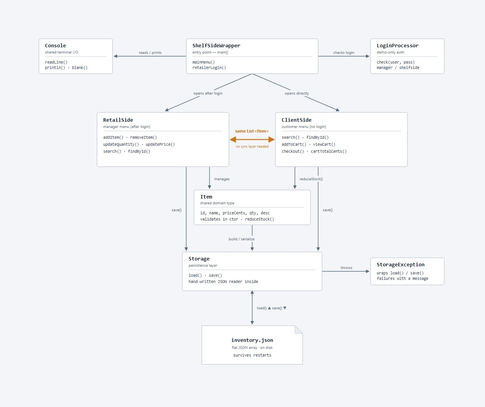

# Shelf Side

A small command-line retail inventory app for CS 2114. A store **manager**
(retailer) can manage products; a **customer** can browse, fill a cart, and
check out. The inventory is stored in a plain JSON file so changes survive
restarting the app.

Everything is written in plain Java with **no outside libraries** in the app
itself (the only downloaded pieces are a JDK to compile with and the JUnit jars
used by the tests).



---

## Compile, test, and run

The easiest way is the included Windows batch scripts. Run them from the project
folder in a terminal (Command Prompt or PowerShell):

| Task | Command |
|------|---------|
| Compile the app | `build.bat` |
| Compile + run all tests | `test.bat` |
| Run the app | `run.bat` |

## Demo login (retailer)

These are **DEMO credentials for a classroom project only** — the username and
password are written in plain text in `LoginProcessor.java`. This is **not real
security** and must never be used to protect anything real.

```
username: manager
password: shelfside
```

The app also prints these on the login screen so they are easy to find during
the demo.

---

## Demo script

Start the app:

```bash
run.bat
```

### Part 1 — a feature that works (customer checkout reduces stock)

```
Main Menu      -> 2   (Customer)
Customer Menu  -> 1   (View products)         see "Coffee Mug ... qty 20"
Customer Menu  -> 4   (Add item to cart)
   Product id  -> 1
   How many    -> 2
Customer Menu  -> 5   (View cart)             shows 2 x Coffee Mug = $17.98
Customer Menu  -> 6   (Checkout)
   confirm     -> yes                         "Thank you! You paid $17.98."
Customer Menu  -> 1   (View products)         Coffee Mug is now qty 18
Customer Menu  -> 0   (Back)
```

Exit and start the app again, view products, and Coffee Mug is **still** qty 18 —
the change was saved to `inventory.json`.

### Part 2 — a bad input that is rejected (not enough stock)

```
Main Menu      -> 2   (Customer)
Customer Menu  -> 4   (Add item to cart)
   Product id  -> 5   (Desk Lamp, only 8 in stock)
   How many    -> 999
                      -> "Only 8 of 'Desk Lamp' in stock."   (cart unchanged)
```

Other bad inputs that are handled with a clear message instead of crashing:

- A blank product name, a negative price, or a negative quantity when adding a
  product (retailer).
- A price typed as letters like `abc`, or with too many decimals like `1.999`.
- A menu choice that is out of range or not a number (it just asks again).
- A missing `inventory.json` (starts with an empty inventory).
- A damaged/malformed `inventory.json` (prints a warning and starts empty).

---

## Project layout

```
src/shelfside/
  Item.java             one product; validation + money helpers (price in cents)
  Storage.java          load/save the JSON file; includes a tiny JSON reader
  StorageException.java carries a clear error message from Storage
  LoginProcessor.java   checks the demo retailer login
  RetailSide.java       retailer menu + operations (add/remove/update/search)
  ClientSide.java       customer menu + cart + checkout
  Console.java          small shared helper for reading input / printing
  ShelfSideWrapper.java main(): loads data, shows the main menu

test/shelfside/         JUnit 4 tests (all use temporary files for storage)
docs/system-diagram.md  diagram of how the classes fit together
inventory.json          starter demo inventory
build.bat / test.bat / run.bat   convenience scripts
```

## How money is stored

Prices are stored as a whole number of **cents** (an `int`) everywhere — in the
code, in the file, and in the tests. `$8.99` is stored as `899`. This keeps all
money math exact and avoids floating-point rounding surprises. `Item` has two
helpers: `parsePriceToCents("8.99")` and `formatCents(899)` -> `"$8.99"`.

## Notes / limitations

- Authentication is a plain-text demo check only (see above).
- The JSON reader supports exactly the format this app writes (a flat list of
  products). It reports a clear error for anything it does not understand.
- No GUI, no database, no real payments, no user accounts — by design.
