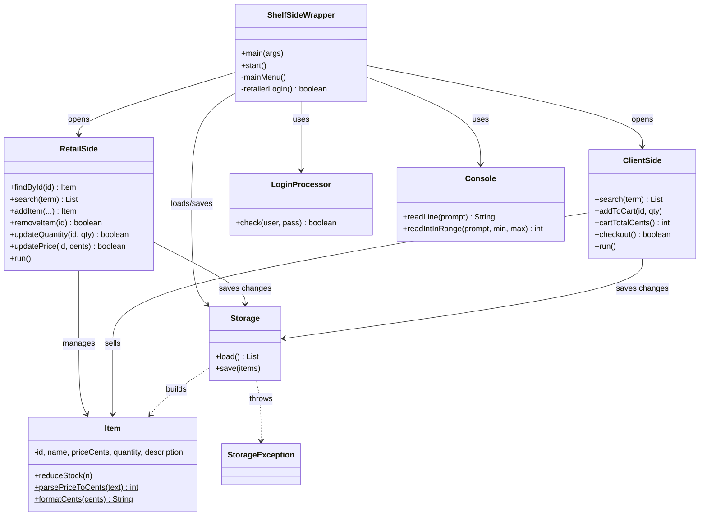

# Shelf Side — System Diagram

This diagram matches the final code. Every box is one class in `src/shelfside/`.

## How the classes fit together

```
                         +------------------------+
                         |   ShelfSideWrapper     |   <-- main(): program start
                         |   (main menu)          |
                         +-----------+------------+
                                     |
             creates & shares one    |    uses to check the demo login
             List<Item> + Storage    |
             with both sides         v
        +----------------------------+----------------------------+
        |                            |                            |
        v                            v                            v
+---------------+          +------------------+          +------------------+
|  RetailSide   |          |   ClientSide     |          |  LoginProcessor  |
| (manager menu)|          | (customer menu)  |          | (demo password)  |
| view/search/  |          | view/search/     |          +------------------+
| add/remove/   |          | details/cart/    |
| update stock  |          | checkout         |
+-------+-------+          +--------+---------+
        |                           |
        |  both read & write the    |
        |  same inventory through   |
        v                           v
              +--------------------------+
              |         Storage          |   load()/save() JSON file
              |  (mini JSON reader here) |   throws StorageException on trouble
              +------------+-------------+
                           |
                           v
                   +---------------+
                   | inventory.json|   (on disk; survives restarts)
                   +---------------+

Shared data type used everywhere:
   +---------------------------------------------+
   |                  Item                        |
   | id, name, priceCents, quantity, description  |
   | + validation, reduceStock(), money helpers   |
   +---------------------------------------------+

Small helper classes:
   Console          - reads keyboard input, prints text (shared by the 3 menus)
   StorageException - carries a clear error message from Storage
```

## Mermaid version (renders on GitHub)



## The one flow that ties it together (customer checkout)

1. `ShelfSideWrapper` loads `inventory.json` into a `List<Item>` via `Storage.load()`.
2. Customer picks items; `ClientSide.addToCart()` refuses any quantity above stock.
3. `ClientSide.checkout()` calls `Item.reduceStock()` on each item, then `Storage.save()`.
4. The new quantities are now on disk, so they are still there next time the app starts.
